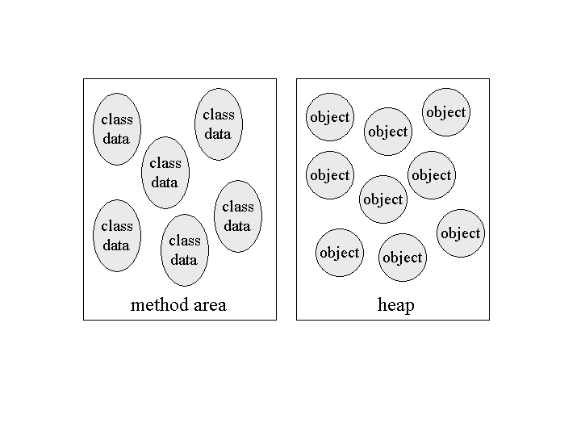
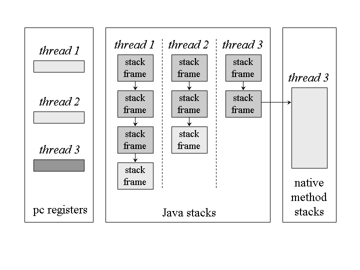
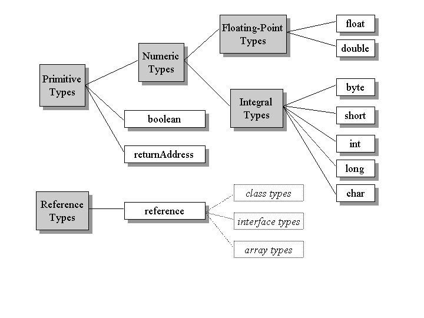
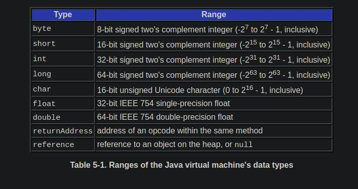

Slogan of java: write once,run anywhere
Slogan of .net : run once ,run always
# Syllabus 

1. Java intro : 1 day  
2.  Datatype : 1 day
3.  JDBC : 2 days
4. Annotation and reflection : 1 day
5. Multithreading : 2 days
6. FIle handling and socket : 2 day
7. Functional programming : 1 day 
8. Collection framework : 2 day
9. Interface : 1 day
10. Abstract class and generics : 1 day
11. Exception Handing : 1 day
12.  Package and Array : 1 day
13.  Enum, Association ,inheritence : 1 day


# Day 1

1. **ppt on basic of java**
# Java introduction

1. Java technology is both a programming language and a platform.
2. developed by James Gosling in 1991, at Sun Microsystems 
3. slogen "Write once , run anywhere"

4. The Java programming language is a high-level language that can be characterized by all of the following buzzwords:

- Simple
- Object oriented
- Distributed
- Multithreaded
- Dynamic
- Architecture neutral
- Portable
- High performance
- Robust
- Secure
  
- In the Java programming language, all source code is first written in plain text files ending with the .java extension.    
   - Those source files are then compiled into .class files by the javac compiler.
   -  A .class file does not contain code that is native to your processor; it instead contains bytecodes — the machine language of the Java Virtual Machine1 (Java VM).
   -   The java launcher tool then runs your application with an instance of the Java Virtual Machine.

- Because the Java VM is available on many different operating systems,
    -  the same .class files are capable of running on Microsoft Windows, the Solaris™ Operating System (Solaris OS), Linux, or Mac OS.
    -   Some virtual machines, such as the Java SE HotSpot at a Glance, perform additional steps at runtime to give your application a performance boost. This includes various tasks such as
       -    finding performance bottlenecks and recompiling (to native code) frequently used sections of code.

5. **The Java Platform**
- A platform is the hardware or software environment in which a program runs.
-  Most platforms can be described as a combination of the operating system and underlying hardware. 
-  The Java platform differs from most other platforms in that it's a software-only platform that runs on top of other hardware-based platforms.

- The Java platform has two components:

    1. **The Java Virtual Machine**
       - it's the base for the Java platform and is ported onto various hardware-based platforms.
    2. **The Java Application Programming Interface (API)**
       - The API is a large collection of ready-made software components that provide many useful capabilities. 
       - It is grouped into libraries of related classes and interfaces; these libraries are known as packages. T

- The API and Java Virtual Machine insulate the program from the underlying hardware.

- As a platform-independent environment, the Java platform can be a bit slower than native code.
-  However, advances in compiler and virtual machine technologies are bringing performance close to that of native code without threatening portability.
 
# requirement for JAVA  : 

- developer need for java development 
     1. **SDK (Software development kit)** 
      + development tools
      + runtime environment
      + Documentation
      + SUpprting libraries
    - 
     1.  **Java Software developmnt kit (JDK)**

      + Java Developmetn tools 
      + Java APi Docs (Application programming runtime)
      + rt.jar [its supporting libraries]
         - same as .NET MSCORLIB file   
         - core java logic kept as  compiled library files
      + JVM (Java virtual machine)

     2. JRE(Java Runtime Environtment) = **[rt.jar + JVM]**
      - now JDK  = 
          + Java Development tools 
          + Java APi Docs 
          + JRE 

### JDK Directory folders

1. bin  
- Contains Java language Developement tools
- we are gonna use
   - java,javadoc,javah,javac
2. Include folder contains header file to use JNI  
 -  JNI = Java Native Interface 
  - Native code = C,C++ code 
  -  we can use JNI to write code in native language and run in java app

3. lib
- contains the files used by development tools
- contains jar files   
-  JAR (Java ARchive) is a package file format typically used to aggregate many Java class files and associated metadata and resources (text, images, etc.) into one file for distribution. 
-  JAR files are archive files that include a Java-specific manifest file. 
  
4. src
 - it is a zip file 
 - .java is extension of java source file
 - contain source code of JAVA API

5. docs
- contains documentation of java api
- i.e html files 

6. jre 
- root directory for java runtime Environmrnt
7. man 
 - contians  documentation of java developemnt tools

### Java Package 
 -  contains 
1. Interfaces
2. Classes
3. Enum
4. Exceptions
5. Errors
6. Annotation Types
7. Sub classes 
8. 
### command to open java manual 
```
> man java

> man javac

> man jar

> man java

> man javap
- Disassembles one or more class files.
```
### Java program 

1. first program
- hello world program
```java
class Program{
 
 public static void main(String[] args){
//c
//printf("Hello world \n");
// C++
//cout<<"Hello world"<<endl;
//c#
//Console.Readline("Hello world");


  System.out.println("Hello World");
 }


}

```

2. **command to compile and run java files**


- to compile  .java file 
  >javac Program.java 

- it creates a .class file, now to run the java file 
> java Program  


1. flow of java 
2. JRE 
3. compile  classes as output are created for 
 -  per class in .java file 
 - e.g 
- 1. Interfaces
  2. Classes
  3. Enum
   

# Day 2 

-  (reference) **ppt on Buzz words in java** 
- these are design goals of java: 
- ten principle of sun microsystem :
1. **Simple**
 - java is derived from C/C++ 
 - it is simple in comparison on C and C++
   - on basis of  syntax
 - has constructor chaining

2. **Object Oriented**
 - 
3. **Architecture Neutral**
4. **Portable**
5. **Robust**
6. **Multithreaded**
7. **Dynamic**
8. **Secure** 
9. **High Performance**
10. **Distributed**
 
 ### class  notes
1. static member function and constructor cant be virtual , all other clases abd member function be virtual
2. older version program can run on later version, features can get deprecated, but still have backward compatibility,
   - this is not in .NET, there Obsolete features are not supported in future version 
3. reflection example is debugger for getting private data member , intellisense  

4. The Java **Remote Method Invocation** (RMI)
  -  system allows an object running in one Java virtual machine to invoke methods on an object running in another Java virtual machine. 
  -  RMI provides for remote communication between programs written in the Java programming language.
  - since java supports RMI, it is distributed prog languauge.

5. **Access Modifier** 
 - 12 types in java   
 - in comparison to c /c++ , 4 types 
 - 

6. **A Wrapper class** 
 - is a class whose object wraps or contains primitive data types. 
 - When we create an object to a wrapper class, it contains a field and in this field, we can store primitive data types. - In other words, we can wrap a primitive value into a wrapper class object.

### **practical demos** 
1. in java we can overload main method (also call one main to another), in other language ??
    ```c#
     public static void main(String[] args) {
		
		System.out.println("Hello ");  
		
		//Program::main(10,20); c++
		Program.main(1, 2);
		main(10,20);
	}

   // in java we can overload main method
   public static void main(int num1,int num2)
   {
	   System.out.println("Num1 :" + num1);
	   System.out.println("Num2 : " + num2);
   }

    ```
 2. we can write , main method per class, but only one will be starting main method in it , we need to select it
    - calling main method job of main thread .
      ```c#
          package test;
          {}

             class A
             {
             public static void main(String[] args) {
             		
             		System.out.println("A.main ");  
             		
             	}
             }
             
             public class Program {
             
                public static void main(String[] args) {
             		
             		System.out.println("Program.main ");  
             		
             	}
          }
      ```
    3. different print methods in printstream class  
    ```c#
    public static void main3(String[] args) {
		
		String name = "suraj porje";
		int empid = 26;
		float salary = 90000.45f;
		//System.out.println(name + " " + empid + " " + salary);
		
		System.out.printf("%-25s%-5d%-10.2f \n",name,empid,salary);
		name = "sallu";
		 empid = 36;
		 salary = 60000.45f;
		 System.out.printf("%-25s%-5d%-10.2f \n",name,empid,salary);
		// System.out.println(name + " " + empid + " " + salary);
	    }
	
        public static void main2(String[] args) {
 		
		   System.out.println("DAC,"); // new line print 
	
	   }
	
	
	      public static void main1(String[] args) {
		
		   System.out.print("DAC,"); // same line print 
	
	   }

    ```


    4. when both primitive datatype need conversion  , use c type casting 
     - widening conversion, smaller data type to large datatype conversionm, not required explicit casting 
     -  narrowing conversion,  large datatype conversion to smaller data type, explicitely casting in required
    ```c#
    public static void main(String[] args) {
		
		double num1 = 10.5; //Initialization
	    int  num2 ; // narrowing
		num2 = (int) num1;
		System.out.println("Num2 : " + num2);
		}
	
	
	public static void main2(String[] args) {
		
		int num1 = 10; //Initialization
		double num2 = (double)num1; //wideening 
		System.out.println("Num2 : " + num2);
		
		}
	
     public static void main1(String[] args) {
		
	   int num1 = 10; //Initialization
     // C/C++ type casting 
	   double num2 = (double) num1 ; // Initialization 
	
	    System.out.println("Num2 : " + num2);
	
	
	}


    ```
5.  primitive type are itself not classes, so need wrapper class
 boxing 
    - conversion of primitive type to non primitive type by method it is caleed boxing 
    - e.g for string can use ,method 
     - toString()
     - valueOf
            
 ```c#
     public class Program{
	public static void main(String[] args) {
		String str = "1a2b5"; // Non primitive
		
		int number = Integer.parseInt(str); // Primitive : Unboxing
		
		System.out.println("number : " + number);
		//error : seen in stack trace
	}
	
	
	public static void main4(String[] args) {
		String str = "125"; // Non primitive
		
		int number = Integer.parseInt(str); // Primitive : Unboxing
		
		System.out.println("number : " + number);
	}
	
	public static void main3(String[] args) {
		double number = 10.5;
		String strNumber = Double.toString(number);//Non Primitive : Boxing
		System.out.println(strNumber);
	}
	public static void main2(String[] args) {
		int number = 10;	//Primitive
		//String strNumber = Integer.toString(number); //Non Primitive : Boxing
		String strNumber = String.valueOf(number);//Non Primitive : Boxing
		System.out.println("Number	:	"+strNumber);
	}
		
}

```

  6.    use of scanner class to take input from user, demo 
```c#
public static void main(String[] args) {
		
		Scanner sc = new Scanner(System.in);
		System.out.print("Name : ");
		String name = sc.nextLine();
				
		System.out.print(" Roll no : ");
		int rollNumber = sc.nextInt();
		System.out.print(" Marks : ");
		float marks = sc.nextFloat();
		
		System.out.println(" Name : " + name + " roll no : " + rollNumber + " marks : " + marks);
		
	}


```

### to read 

1. JVM
> https://www.artima.com/insidejvm/ed2/jvm.html

### What is a Java Virtual Machine?

1. The Java virtual machine is called "virtual" because it is an abstract computer defined by a specification.
   -  To run a Java program, you need a concrete implementation of the abstract specification. 
   - here we describe primarily the abstract specification of the Java virtual machine.
   -  To illustrate the abstract definition of certain features,  also  various ways in which those features could be implemented.


2.  when you say "Java virtual machine." You may be speaking of:

    1. the abstract specification,
       - described in detail in the book: The Java Virtual Machine Specification
    2. a concrete implementation
       -  it exist on many platforms and come from many vendors, are either all software or a combination of hardware and software.
    3. a runtime instance.
       -  A runtime instance hosts a single running Java application.
        
3.  Each Java application runs inside a runtime instance of some concrete implementation of the abstract specification of the Java virtual machine.


4. **The Lifetime of a Java Virtual Machine**
- A runtime instance of the Java virtual machine has a clear mission in life:
   -  to run one Java application. 
-  When a Java application starts, a runtime instance is born.
-   When the application completes, the instance dies. 
-   If you start three Java applications at the same time, on the same computer, using the same concrete implementation, you'll get three Java virtual machine instances. 
-   Each Java application runs inside its own Java virtual machine.

- A Java virtual machine instance starts running its solitary application by invoking the main() method of some initial class. 
- The main() method must be public, static, return void, and accept one parameter: a String array. Any class with such a main() method can be used as the starting point for a Java application.

For example, consider an application that prints out its command line arguments:
```java
// On CD-ROM in file jvm/ex1/Echo.java
class Echo {

    public static void main(String[] args) {
        int len = args.length;
        for (int i = 0; i < len; ++i) {
            System.out.print(args[i] + " ");
        }
        System.out.println();
    }
}
```


5. Inside the Java virtual machine, threads come in two flavors:
-  daemon and non- daemon. 
    -  **A daemon thread** is ordinarily a thread used by the virtual machine itself, such as a thread that performs garbage collection. The application, however, can mark any threads it creates as daemon threads. 
    -  The initial thread of an application--the one that begins at main()--is a **non- daemon thread**.

    - A Java application continues to execute (the virtual machine instance continues to live) as long as any non-daemon threads are still running.
    -  When all non-daemon threads of a Java application terminate, the virtual machine instance will exit. 
    -  If permitted by the security manager, the application can also cause its own demise by invoking the exit() method of class Runtime or System.
  

###  The Architecture of the Java Virtual Machine
In the Java virtual machine specification, the behavior of a virtual machine instance is described in terms of subsystems, memory areas, data types, and instructions. These components describe an abstract inner architecture for the abstract Java virtual machine. The purpose of these components is not so much to dictate an inner architecture for implementations. It is more to provide a way to strictly define the external behavior of implementations. The specification defines the required behavior of any Java virtual machine implementation in terms of these abstract components and their interactions.

Figure 5-1 shows a block diagram of the Java virtual machine that includes the major subsystems and memory areas described in the specification. As mentioned in previous chapters, each Java virtual machine has a class loader subsystem: a mechanism for loading types (classes and interfaces) given fully qualified names. Each Java virtual machine also has an execution engine: a mechanism responsible for executing the instructions contained in the methods of loaded classes.


Figure 5-1. The internal architecture of the Java virtual machine.
When a Java virtual machine runs a program, it needs memory to store many things, including bytecodes and other information it extracts from loaded class files, objects the program instantiates, parameters to methods, return values, local variables, and intermediate results of computations. The Java virtual machine organizes the memory it needs to execute a program into several runtime data areas.

Although the same runtime data areas exist in some form in every Java virtual machine implementation, their specification is quite abstract. Many decisions about the structural details of the runtime data areas are left to the designers of individual implementations.

Different implementations of the virtual machine can have very different memory constraints. Some implementations may have a lot of memory in which to work, others may have very little. Some implementations may be able to take advantage of virtual memory, others may not. The abstract nature of the specification of the runtime data areas helps make it easier to implement the Java virtual machine on a wide variety of computers and devices.

Some runtime data areas are shared among all of an application's threads and others are unique to individual threads. Each instance of the Java virtual machine has one method area and one heap. These areas are shared by all threads running inside the virtual machine. When the virtual machine loads a class file, it parses information about a type from the binary data contained in the class file. It places this type information into the method area. As the program runs, the virtual machine places all objects the program instantiates onto the heap. See Figure 5-2 for a graphical depiction of these memory areas.



Figure 5-2. Runtime data areas shared among all threads.
As each new thread comes into existence, it gets its own pc register (program counter) and Java stack. If the thread is executing a Java method (not a native method), the value of the pc register indicates the next instruction to execute. A thread's Java stack stores the state of Java (not native) method invocations for the thread. The state of a Java method invocation includes its local variables, the parameters with which it was invoked, its return value (if any), and intermediate calculations. The state of native method invocations is stored in an implementation-dependent way in native method stacks, as well as possibly in registers or other implementation-dependent memory areas.

The Java stack is composed of stack frames (or frames). A stack frame contains the state of one Java method invocation. When a thread invokes a method, the Java virtual machine pushes a new frame onto that thread's Java stack. When the method completes, the virtual machine pops and discards the frame for that method.

The Java virtual machine has no registers to hold intermediate data values. The instruction set uses the Java stack for storage of intermediate data values. This approach was taken by Java's designers to keep the Java virtual machine's instruction set compact and to facilitate implementation on architectures with few or irregular general purpose registers. In addition, the stack-based architecture of the Java virtual machine's instruction set facilitates the code optimization work done by just-in-time and dynamic compilers that operate at run-time in some virtual machine implementations.

See Figure 5-3 for a graphical depiction of the memory areas the Java virtual machine creates for each thread. These areas are private to the owning thread. No thread can access the pc register or Java stack of another thread.



Figure 5-3. Runtime data areas exclusive to each thread.
Figure 5-3 shows a snapshot of a virtual machine instance in which three threads are executing. At the instant of the snapshot, threads one and two are executing Java methods. Thread three is executing a native method.

In Figure 5-3, as in all graphical depictions of the Java stack in this book, the stacks are shown growing downwards. The "top" of each stack is shown at the bottom of the figure. Stack frames for currently executing methods are shown in a lighter shade. For threads that are currently executing a Java method, the pc register indicates the next instruction to execute. In Figure 5-3, such pc registers (the ones for threads one and two) are shown in a lighter shade. Because thread three is currently executing a native method, the contents of its pc register--the one shown in dark gray--is undefined.


### Data Types
The Java virtual machine computes by performing operations on certain types of data. Both the data types and operations are strictly defined by the Java virtual machine specification. The data types can be divided into a set of primitive types and a reference type. Variables of the primitive types hold primitive values, and variables of the reference type hold reference values. Reference values refer to objects, but are not objects themselves. Primitive values, by contrast, do not refer to anything. They are the actual data themselves. You can see a graphical depiction of the Java virtual machine's families of data types in Figure 5-4.



Figure 5-4. Data types of the Java virtual machine.
All the primitive types of the Java programming language are primitive types of the Java virtual machine. Although boolean qualifies as a primitive type of the Java virtual machine, the instruction set has very limited support for it. When a compiler translates Java source code into bytecodes, it uses ints or bytes to represent booleans. In the Java virtual machine, false is represented by integer zero and true by any non-zero integer. Operations involving boolean values use ints. Arrays of boolean are accessed as arrays of byte, though they may be represented on the heap as arrays of byte or as bit fields.

The primitive types of the Java programming language other than boolean form the numeric types of the Java virtual machine. The numeric types are divided between the integral types: byte, short, int, long, and char, and the floating- point types: float and double. As with the Java programming language, the primitive types of the Java virtual machine have the same range everywhere. A long in the Java virtual machine always acts like a 64-bit signed twos complement number, independent of the underlying host platform.

The Java virtual machine works with one other primitive type that is unavailable to the Java programmer: the returnAddress type. This primitive type is used to implement finally clauses of Java programs. The use of the returnAddress type is described in detail in Chapter 18, "Finally Clauses."

The reference type of the Java virtual machine is cleverly named reference. Values of type reference come in three flavors: the class type, the interface type, and the array type. All three types have values that are references to dynamically created objects. The class type's values are references to class instances. The array type's values are references to arrays, which are full-fledged objects in the Java virtual machine. The interface type's values are references to class instances that implement an interface. One other reference value is the null value, which indicates the reference variable doesn't refer to any object.

The Java virtual machine specification defines the range of values for each of the data types, but does not define their sizes. The number of bits used to store each data type value is a decision of the designers of individual implementations. The ranges of the Java virtual machines data type's are shown in Table 5-1. More information on the floating point ranges is given in Chapter 14, "Floating Point Arithmetic."


-  Ranges of the Java virtual machine's data types

### Word Size
The basic unit of size for data values in the Java virtual machine is the word--a fixed size chosen by the designer of each Java virtual machine implementation. 

The specification of many of the Java virtual machine's runtime data areas are based upon this abstract concept of a word. For example, two sections of a Java stack frame--the local variables and operand stack-- are defined in terms of words. These areas can contain values of any of the virtual machine's data types. When placed into the local variables or operand stack, a value occupies either one or two words.

As they run, Java programs cannot determine the word size of their host virtual machine implementation. The word size does not affect the behavior of a program. It is only an internal attribute of a virtual machine implementation.


1. why main method is static? (an swer as what when it is not static)
2.  to compile java program , need atleast one class
3.  Package java.lang
 > https://docs.oracle.com/javase/8/docs/api/

5. can we write helloworld program , without giving semicolon ?? yes 


# Day3 

### demo on java 
- 1. JOptionPane 
```java


import javax.swing.JOptionPane;


public static void main1(String[] args) {
		String name = JOptionPane.showInputDialog("Enter Name");
		int empid = Integer.parseInt( JOptionPane.showInputDialog("Enter Empid") );
		float salary = Float.parseFloat(JOptionPane.showInputDialog("Enter Salary"));
		
		System.out.println("Name	:	"+name);
		System.out.println("Empid	:	"+empid);
		System.out.println("Salary	:	"+salary);
	}

```

-  2. BufferedReader and InputStreamReader 
```java

 import java.io.BufferedReader;
import java.io.InputStreamReader;
public static void main3(String[] args)throws Exception {
		BufferedReader reader = new BufferedReader( new InputStreamReader(System.in));
		
		System.out.print("Name	:	");
		String name = reader.readLine();
		System.out.print("Roll Number	:	");
		int number = Integer.parseInt( reader.readLine() );
		System.out.print("Marks	:	");
		float marks = Float.parseFloat(reader.readLine());
		
		System.out.println("Name	:	"+name);
		System.out.println("Number	:	"+number);
		System.out.println("Marks	:	"+marks);
	}

```
- 3.  scanner 
```java
import java.util.Scanner;
public static void main4(String[] args) {
		
		try(Scanner sc = new Scanner(System.in)){
			System.out.print("Name	:	");
			String name = sc.nextLine();
			System.out.print("Number	:	");
			int number = sc.nextInt();
			System.out.print("Balance	:	");
			float balance = sc.nextFloat();
			
			System.out.println("Name	:	"+name);
			System.out.println("Number	:	"+number);
			System.out.println("Balance	:	"+balance);
		}
	}

```
- 4. demo:  Anonymous Instance
- if we create instance without refrence is anonymous instance
   use when 
     - 1. when we want to use instance only once
       - to pass method as a argument
       ```java
         Person p = new Person();
         p.setName("suraj");
         p.setBirthDate(new Date(23,7,1994));


       ``` 
     - 2. if we want to use any instance as a method argument or if want to use any instance as  a exception then it should by anonymous


```c#

class Accounts{
	//Field // default -> package level private
  private int number; // 0
  private String type; // null
  private float balance; // 0.0
}

main(){
new Accounts(); //instance without name, is anonymous instance
}
```
- 5. Constructor chaining
  -  this it, to achieve constructor reusability, we can call constructor from another constructor
  - for CC we should we this statement inside constructor body 
     - this statement must be first statment in constructor body 
```java
public Account() {
		this(1105, "Current", 85000);	//Constructor Chaining
	}
	public Account(int number, String type, float balance) {
		this.number = number;
		this.type = type;
		this.balance = balance;
	}
```
- 6. Null Object
- 1.  Literal (constant value) in Java: 
- literal  : datatype

1. true :      boolean
2. 'A' :       char
3. 12345 :     int 
4. 3.142 :     double
5. "Sunbeam" : String
6. new Date(): Date
7. null :      reference variable

```java
---

in C/C++
//here null is a macro ,
int *ptr = NULL;
---

in java 

// null is a literal, to initialize an object
Account account = null;

//if refernece value contains null value , it its called as null object/null reference variable
// gives error : NullPointerException
   //Calling the instance method of a null object.

to solve two methods 
1. 
		 if(acc1 != null) { acc1.printRecord(); }
2. 	acc1 = new Accounts(); //instantiation
```
- 7.  **Creating refrence(instance)**
     -  if we want to perform operations on instance then it is neccessary to create  reference to it.

```java

Account acc1; // in C++ : object
Account acc2; // in java: Reference
Account acc3 = new Account(); // in java: acc3: Reference
```

- consider following statement
```java
    Accounts a1 = new Accounts(1001,"Saving",45000);
	Accounts a2 = a1;
   Account a3 = new Account(1002,"Saving",45000);
```
- answer : 2 instance, 3 reference 

- 8.  Comments in java 

```java

1. //Single line comment
2. /* Multi line comment */
3. /** Java doc comment **/


```

- 9. in class ,
  - right click,
  - select source --> generate getter/setter
  
- 10. 


### class Notes : 


1. in java has no structure and union 

2. in java ,object is called as instance 

3. class 


  

 

 
 


1. **this** key word in java
 - 1. it is implicit reference variable available with all non static method of a class
    - which id used to store referemnnce  of current/calling instance
- 2. Using this refrence non static field and method can communicate with each other hence it is consider as line/connection 


1.  Constructor
  - if we want to initialize instance ,then we should use constructor
  - Types: 
     1. Parameterless C (default C)
     2. Parameterized C
     3. Default constructor
  - constructor initialize created instance


12.
14. 