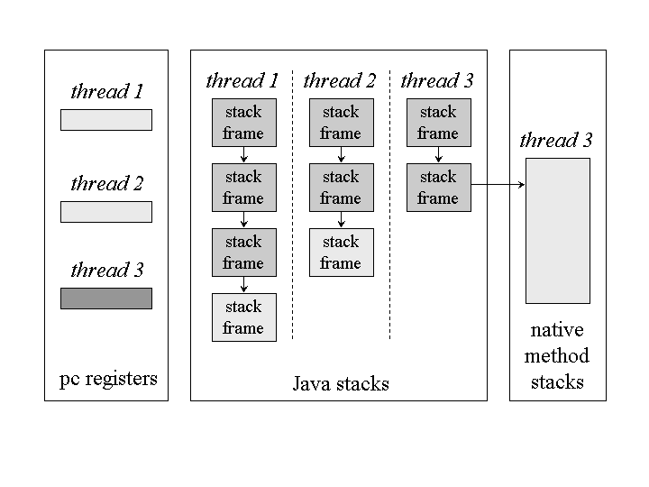
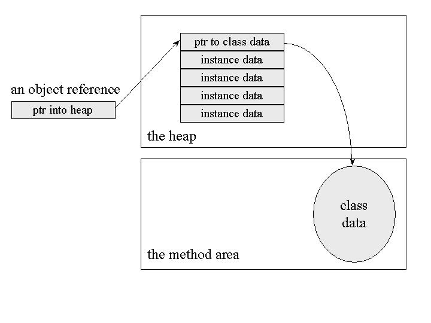
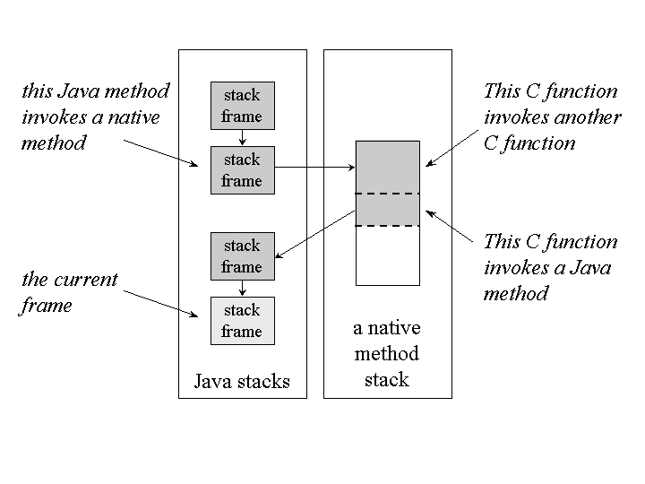

1. JVM
> https://www.artima.com/insidejvm/ed2/jvm.html


### Answer to What is a JVM ? day2

1. The JVM is called "virtual" because it is an abstract computer defined by a specification.
   -  To run a Java program, you need a concrete implementation of the abstract specification. 
   - here we describe primarily the abstract specification of the JVM.
   - The JVM is responsible for the memory safety, platform independence, and security features of the Java programming language.
  

2.  when you say **"JVM."** You may be speaking of:

    1. the abstract specification,
       - described in detail in the book: The JVM Specification
    2. a concrete implementation
       -  it exist on many platforms and come from many vendors, are either all software or a combination of hardware and software.
    3. a runtime instance.
       -  A runtime instance hosts a single running Java application.
        
3.  Each Java application runs inside a runtime instance of some concrete implementation of the abstract specification of the JVM.


4. **The Lifetime of a JVM**
- A runtime instance of the JVM has a clear mission in life:
   -  to run one Java application. 
-  When a Java application starts, a runtime instance is born.
-   When the application completes, the instance dies. 
-   If you start three Java applications at the same time, on the same computer, using the same concrete implementation, you'll get three JVM instances. 
-   Each Java application runs inside its own JVM.

- A JVM instance starts running its solitary application by invoking the main() method of some initial class. 
- The main() method must be public, static, return void, and accept one parameter: a String array. 

1. Inside the JVM, threads come in two flavors:
-  daemon and non- daemon. 
    -  **A daemon thread** is ordinarily a thread used by the virtual machine itself, **such as a thread that performs garbage collection.** The application, however, can mark any threads it creates as daemon threads. 
    -  The initial thread of an application--the **one that begins at main()--is a non- daemon thread**.

    - A Java application continues to execute (the virtual machine instance continues to live) as long as any non-daemon threads are still running.
    -  When all non-daemon threads of a Java application terminate, the virtual machine instance will exit. 
    -  If permitted by the security manager, the **application can also cause its own demise by invoking the exit() method** of class Runtime or System.
  

###  The Architecture of the JVM
- In the JVM specification, 
  - the behavior of a virtual machine instance is described in terms of
     -  subsystems
     -   memory areas
     -    data types,
     -    and instructions
  -  These components describe an abstract inner architecture for the abstract JVM. 
  -  The purpose of these components 
        -    is more to provide a way to strictly define the external behavior of implementations. 
  -   The specification defines the required behavior of any JVM implementation in terms of these abstract components and their interactions.

- the major subsystems and memory areas described in the specification , each JVM has 
   1. a class loader subsystem:
    -  a mechanism for loading types (classes and interfaces). 
   2. a execution engine: 
   - a mechanism responsible for executing the instructions contained in the methods of loaded classes.


- The internal architecture of the JVM.
- The JVM organizes the memory it needs to execute a program into several runtime data areas.

- Although the same runtime data areas exist in some form in every JVM implementation, their specification is quite abstract. 
- The abstract nature of the specification of the runtime data areas helps make it easier to implement the JVM on a wide variety of computers and devices.

-  Each instance of the JVM has one method area and one heap. 
-  These areas are shared by all threads running inside the virtual machine. 
-  When the virtual machine loads a class file, it parses information about a type from the binary data contained in the class file. 
-  It places this type information into the method area. 
-  As the program runs, the virtual machine places all objects the program instantiates onto the heap. S


Figure 5-2. Runtime data areas shared among all threads.

- The JVM has no registers to hold intermediate data values.
-  The instruction set uses the Java stack for storage of intermediate data values. 
-  This approach was taken by Java's designers to keep the JVM's instruction set compact and to facilitate implementation on architectures with few or irregular general purpose registers.
-   In addition, the stack-based architecture of the JVM's instruction set
    -  facilitates the code optimization work done by just-in-time and dynamic compilers that operate at run-time in some virtual machine implementations.



### Data Types
The JVM computes by performing operations on certain types of data.
 Both the data types and operations are strictly defined by the JVM specification.
  The data types can be divided into a set of
  1. **primitive types** 
    -  Variables of the primitive types hold primitive values
    -  Primitive values, do not refer to anything. They are the actual data themselves.
    1. All the primitive types of the Java programming language are primitive types of the JVM. 
    2. Although boolean qualifies as a primitive type of the JVM, the instruction set has very limited support for it.
- compiler  uses ints or bytes to represent booleans. **In the JVM, false is represented by integer zero and true by any non-zero integer.** Operations involving boolean values use ints. 

    3. The numeric types are divided between 
         - the integral types: byte, short, int, long, and char, and 
         - the floating- point types: float and double. 
         - As with the Java programming language, the primitive types of the JVM have the same range everywhere. 
         - A long in the JVM always  a 64-bit number, independent of the underlying host platform.

    4. The JVM works with one other primitive type that is unavailable to the Java programmer:
       -  the returnAddress type.
          -  This primitive type is used to implement finally clauses of Java programs. 

  2. **a reference type.**
   - variables of the reference type hold reference values. 
   -  Reference values refer to objects, but are not objects themselves. 
    1. The reference type of the JVM is cleverly named reference.
    2.  Values of type reference come in three flavors:
	-  the class type, 
	-  the interface type,
	-   and the array type. 
	3. All three types have values that are references to dynamically created objects.
	-  The class type's values are references to class instances.
	-  The array type's values are references to arrays, which are full-fledged objects in the JVM.
	-  The interface type's values are references to class instances that implement an interface. 
	4. One other reference value is the null value, which indicates the reference variable doesn't refer to any object.


-  Ranges of the JVM's data types

### Word Size
1. The basic unit of size for data values in the JVM is the word--a fixed size chosen by the designer of each JVM implementation. 

2. The specification of many of the JVM's runtime data areas are based upon this abstract concept of a word.
3.  For example:
  -  two sections of a Java stack frame--the local variables and operand stack-- are defined in terms of words. 
  -  These areas can contain values of any of the virtual machine's data types. 
  -  When placed into the local variables or operand stack, a value occupies either one or two words.

4. The word size does not affect the behavior of a program. It is only an internal attribute of a virtual machine implementation.


# day 3 

### The Class Loader Subsystem

1. The part of a Java virtual machine implementation that takes care of finding and loading types is the class loader subsystem. 
- 1. The class loader subsystem is primarily responsible for 
   +  locating and importing the binary data for classes.
   +  verifying the correctness of imported classes,
   +   allocate and initialize memory for class variables, 
   +   and assist in the resolution of symbolic references.
- 2.  The class loader subsystem involves 
-  many other parts of the JVM and several classes from the java.lang library.
-  For example,
   1. user-defined class loaders are regular Java objects whose class descends from java.lang.ClassLoader.
   2.   The methods of class ClassLoader allow Java applications to access the virtual machine's class loading machinery.
   3.     Also, for every type a Java virtual machine loads, it creates an instance of class java.lang.Class to represent that type.
-  Like all objects, 
-  **user-defined class loaders and instances of class Class reside on the heap**
-  **Data for loaded types resides in the method area**   

2. the Java virtual machine contains **two kinds of class loaders**: 
1. **a bootstrap class loader**  
    1. it is a part of the virtual machine implementation, 
    - Every JVM implementation has a bootstrap class loader,
       -  knows how to load trusted classes, including the classes of the Java API.
    -  The JVM specification doesn't define how the bootstrap loader should locate classes, its for  to implementation designers to decide.
    2. Given a fully qualified type name, the bootstrap class loader must in some way attempt to produce the data that defines the type.
    -  One common approach ffor this is 
    1. This implementation searches a user-defined directory path stored in an environment variable named CLASSPATH. 
    -   The bootstrap loader looks in each directory, given in the CLASSPATH, until it finds a file with the appropriate name: the type's simple name plus ".class".
    -    Unless the type is part of the unnamed package, the bootstrap loader expects the file to be in a subdirectory of one the directories in the CLASSPATH. 
    -    The path name of the subdirectory is built from the package name of the type.
    -     For example, if the bootstrap class loader is searching for class java.lang.Object, it will look for Object.class in the java\lang subdirectory of each CLASSPATH directory.
    3. the bootstrap class loader of Sun's Java 2 SDK only looks in the directory in which the system classes (the class files of the Java API) were installed. 
     -  In Sun's Java 2 SDK virtual machine, searching the class path is the job of the system class loader, a user-defined class loader that is created automatically when the virtual machine starts up.
2. **User-Defined Class Loaders**
- it are part of the running Java application.
-  Classes loaded by different class loaders are placed into separate Namespaces inside the Java virtual machine.
- Although user-defined class loaders themselves are part of the Java application, 
- 1.  four of the methods in class ClassLoader are gateways into the JVM:
   -  methods declared in class java.lang.ClassLoader:
    ```java
    1. protected final Class defineClass(String name, byte data[],int offset, int length);
    2. protected final Class defineClass(String name, byte data[], int offset, int length, ProtectionDomain     protectionDomain);
    3. protected final Class findSystemClass(String name);
    4. protected final void resolveClass(Class c);
    ```
    - Any Java virtual machine implementation must take care to connect these methods of class ClassLoader to the internal class loader subsystem.

- 1.  **defineClass()**
-  Every Java virtual machine implementation must make sure the defineClass() method of class ClassLoader can cause a new type to be imported into the method area.
-   When defineClass() returns a Class instance, the binary file for the type has definitely been located and imported into the method area, but not necessarily linked and initialized., so need resolveClass() method.

- 2. **findSystemClass()**
-  Every Java virtual machine implementation must make sure the findSystemClass() method can invoke the bootstrap  or system class loader to load the requested type,
-  If already loaded or successfully loads the type,
    -   it returns a reference to the Class object representing the type. 
    -   If it can't locate the binary data for the type, it throws ClassNotFoundException..

- 3. **resolveClass()**
- The resolveClass() method accepts a reference to a Class instance.
-  This method causes the type represented by the Class instance to be linked (if it hasn't already been linked).
-  The defineClass() method,  only takes care of loading the type.  
-   Java virtual machine implementations make sure the resolveClass() method of class ClassLoader can cause the class loader subsystem to perform linking.

###  how a Java virtual machine performs class loading, linking, and initialization, with user- defined class loaders is given in Chapter 8, "The Linking Model."
  
3. **Loading, Linking and Initialization**

-    The activities here are performed in a strict order:
1. **Loading** 
- finding and importing the binary data for a type
 2. **Linking**
-  performing verification, preparation, and (optionally) resolution
- 1. Verification: 
- ensuring the correctness of the imported type
- 2. Preparation: 
- allocating memory for class variables and initializing the memory to default values
- 3. Resolution:
-  transforming symbolic references from the type into direct references.
3. **Initialization**
-  invoking Java code that initializes class variables to their proper starting values.

4.  **Name Spaces**
-   1.  each class loader maintains its own name space populated by the types it has loaded.
    - Because each class loader has its own name space, a single Java application can load multiple types with the same fully qualified name.
    - i.e A type's fully qualified name, therefore, is not always enough to uniquely identify it inside a Java virtual machine instance.
    1.   If multiple types of that same name have been loaded into different name spaces, 
    - the identity of the class loader that loaded the type (the identity of the name space it is in) will also be needed to uniquely identify that type.
    1. Name spaces arise inside a JVM instance as a result of the process of resolution. 
    - As part of the data for each loaded type, the JVM keeps track of the class loader that imported the type. When the virtual machine needs to resolve a symbolic reference from one class to another, it requests the referenced class from the same class loader that loaded the referencing class.


5. **The Method Area**
- 1. Inside a JVM instance, information about loaded types is stored in a logical area of memory called the method area.
-  When the JVM loads a type, it uses a class loader to locate the appropriate class file.
-   The class loader reads in the class file, 
  - as linear stream of binary data and passes it to the virtual machine. 
  - The virtual machine extracts information about the type from the binary data and stores the information in the method area.
- Memory for class (static) variables declared in the class is also taken from the method area.

- 2. The manner in which a JVM implementation represents type information internally is a decision of the implementation designer. 
- For example, multi-byte quantities in class files are stored in big- endian (most significant byte first) order. When the data is imported into the method area.

- 3. All threads share the same method area, so access to the method area's data structures must be designed to be thread-safe. i.e only one thread should be allowed to load a class while the other one waits.

- 4. The size of the method area need not be fixed. As the Java application runs, the virtual machine can expand and contract the method area to fit the application's needs. 
- Also, the memory of the method area need not be contiguous. It could be allocated on a heap--even on the virtual machine's own heap.

- 5. The method area can also be garbage collected.
-  Because Java programs can be dynamically extended via user-defined class loaders, classes can become "unreferenced" by the application.
-   If a class becomes unreferenced, a JVM can unload the class (garbage collect it) to keep the memory occupied by the method area at a minimum. 


6. **Type(class/interface) Information**
- For each type it loads, a JVM must store the following kinds of information in the method area:
1. The fully qualified name of the type
2. "                                 " direct superclass unless ,
  - the type is an interface or class java.lang.Object, neither of which have a superclass
3. Whether or not the type is a class or an interface
4. The type's modifiers ( some subset of` public, abstract, final)
5. An ordered list of the fully qualified names of any direct superinterfaces
Inside the Java class file and JVM, 
- type names are always stored as fully qualified names. 
    -  For example, the fully qualified name of class Object in package java.lang is java.lang.Object.
    -  In class files, the dots are replaced by slashes, as in java/lang/Object. 
-  In the method area, fully qualified names can be represented as designer chooses.

- In addition to the basic type information listed previously, the virtual machine must also store for each loaded type:

1. **The constant pool for the type**
- A constant pool is an ordered set of constants used by the type, including literals (string, integer, and floating point constants) and symbolic references to types, fields, and methods.
-  Because it holds symbolic references to all types, fields, and methods used by a type, the constant pool plays a central role in the dynamic linking of Java programs.
7. **Field information**
- For each field declared in the type, 
- the following information must be stored in the method area. 
    - The field's name
    - The field's type
    - The field's modifiers (some subset of public, private, protected, static, final, volatile, transient)
- -  the order in which the fields are declared by the class or interface must also be recorded. 
8. **Method information**
- For each method declared in the type, the following information must be stored in the method area.
    - The method's name
    - The method's return type (or void)
    - The number and types (in order) of the method's parameters
    - The method's modifiers (some subset of public, private, protected, static, final, synchronized, native, abstract)
    - the order in which the methods are declared by the class or interface must be recorded as well as the data.
- following information must also be stored with each method that is not abstract or native:
    - The method's bytecodes   
    - The sizes of the operand stack and local variables sections of the method's stack frame  

9. **All class (static) variables declared in the type, except constants**
- Class variables are shared among all instances of a class and can be accessed even in the absence of any instance.
-  These variables are associated with the class--not with instances of the class--so they are logically part of the class data in the method area.
-   Constants (class variables declared final) are not treated in the same way as non-final class variables.
    -  As part of the constant pool, final class variables are stored in the method area--just like non-final class variables.   

10.  **A Reference to Class ClassLoader**
- For each type it loads, a JVM must keep track of whether or not the type was loaded via the bootstrap class loader or a user-defined class loader.
-  For those types loaded via a user-defined class loader,
    -   **the virtual machine must store a reference to the user-defined class loader that loaded the type**.
    -    This information is stored as part of the type's data in the method area.

- The virtual machine uses this information during 
- <abbr title="explanation of Dynamc linking"><b> dynamic linking </b></abbr>
-  When one type refers to another type,
    - the virtual machine requests the referenced type from the same class loader that loaded the referencing type.
-  This process of dynamic linking is also central to the way the virtual machine forms separate name spaces.
-   To be able to properly perform dynamic linking and maintain multiple name spaces, the virtual machine needs to know what class loader loaded each type in its method area.
   
11. **A Reference to Class Class**
- An instance of class java.lang.Class is created by the JVM for every type it loads. 
- The virtual machine must in some way associate a reference to the Class instance for a type with the type's data in the method area.
- Your Java programs can obtain and use references to Class objects.
1.  One static method in class Class, allows you to get a reference to the Class instance for any loaded class:
- A method declared in class java.lang.Class:
> public static Class forName(String className);
-  You can use forName() to get a Class reference for any loaded type from any package, loaded into the current name space.

2. An alternative way to get a Class reference is to invoke getClass() on any object reference. 
- This method is inherited by every object from class Object itself:
-  A method declared in class java.lang.Object:
> public final Class getClass();
If you have a reference to an object of class java.lang.Integer, 
for example, get Class object for java.lang.Integer  by invoking getClass() on  reference to the Integer object.

- If you look at these methods, you will quickly realize that class Class gives the running application access to the information stored in the method area. Here are some of the methods declared in class in java.lang.Class :
> public String getName();
> public Class getSuperClass();
> public boolean isInterface();
> public Class[] getInterfaces();
> public ClassLoader getClassLoader();
- These methods just return information about a loaded type. 
-  All this information comes straight out of the method area.

7. **Method Tables**
- The type information stored in the method area must be organized to be quickly accessible, for this a data structure is used called
>  a method table.
-   **A method table is an array of direct references to all the instance methods that may be invoked on a class instance, including instance methods inherited from superclasses.** 
-   For each non-abstract class a JVM loads,
    -    it could generate a method table and include it as part of the class information it stores in the method area. 
-   it i an example of data structures that speed up access to the raw data.
-   A method table allows a virtual machine to quickly locate an instance method invoked on an object. 
-   A method table isn't helpful in the case of abstract classes or interfaces, because the program will never instantiate these.


8. **The Heap**
- Whenever a class instance or array is created in a running Java application,
-  the memory for the new object is allocated from a single heap. 
-  As there is only one heap inside a JVM instance, all threads share it. 
-  Because a Java application runs inside its "own" exclusive JVM instance, there is a separate heap for every individual running application. 
-  There is no way two different Java applications could trample on each other's heap data. 
-  Two different threads of the same application, however, could trample on each other's heap data. so need proper synchronization of multi-threaded access to objects (heap data) in your Java programs.

- The JVM has an instruction that allocates memory on the heap for a new object, but has no instruction for freeing that memory.
-  Just as you can't explicitly free an object in Java source code, you can't explicitly free an object in Java bytecodes. 
-  The virtual machine itself is responsible for deciding whether and when to free memory occupied by objects that are no longer referenced by the running application.
-   Usually, a JVM implementation uses a garbage collector to manage the heap.


9. **Garbage Collection**
- A garbage collector's primary function is
    1. to automatically reclaim the memory used by objects that are no longer referenced by the running application. 
    2. It may also move objects as the application runs to reduce heap fragmentation.

- A garbage collector is not strictly required by the JVM specification.
-  The specification only requires that an implementation manage its own heap in some manner.


10.**Object Representation**
- 1. The Java virtual machine specification is silent on how objects should be represented on the heap.   
- 2. Object representation,an integral aspect of the overall design of the heap and garbage collector,is a decision of implementation designers

- 3. The primary data that must in some way be represented for each object is
    -  the instance variables declared in the object's class and all its superclasses. 
- Given an object reference, 
    - the virtual machine must be able to quickly locate the instance data for the object.
    -  In addition, there must be some way to access an object's class data (stored in the method area) given a reference to the object. 
    -  For this reason, the memory allocated for an object usually includes some kind of pointer into the method area.

- 4. ways for object representation
1. possible heap design divides the heap into two parts:
   -  a handle pool and
   -   an object pool. 
   -   An object reference is a native pointer to a handle pool entry.
- A handle pool entry has two components: 
     - a pointer to instance data in the object pool and
     -  a pointer to class data in the method area.
- The advantage of this scheme is that
    -  it makes it easy for the virtual machine to combat heap fragmentation. 
-   The disadvantage of this approach is that 
    - every access to an object's instance data requires dereferencing two pointers.
-  This kind of heap is demonstrated interactively by the HeapOfFish applet


2. this design makes an object reference a native pointer to a bundle of data that contains the object's instance data and a pointer to the object's class data.
-  This approach requires dereferencing only one pointer to access an object's instance data, but makes moving objects more complicated. 
-  When the virtual machine moves an object to combat fragmentation of this kind of heap,
    -   it must update every reference to that object anywhere in the runtime data areas. 

  


- No matter what object representation an implementation uses, 
- it is likely that a method table is close at hand for each object.
-  Method tables,
   -   because they speed up the invocation of instance methods,
- it can play an important role in achieving good overall performance for a virtual machine implementation.


11. **Array Representation**
1. In Java, arrays are full-fledged objects.
  -  Like objects, arrays are always stored on the heap.
  -  Also like objects, implementation designers can decide how they want to represent arrays on the heap.

2. Arrays have a Class instance associated with their class, just like any other object. 
- All arrays of the same dimension and type have the same class. 
- The length of an array does not play any role in establishing the array's class. 

3. Multi-dimensional arrays are represented as arrays of arrays.
 - A two dimensional array of ints, for example, would be represented by a **one dimensional array of references to several one dimensional arrays of ints.** 

 

6. The data that must be kept on the heap for each array is 
 - the array's length,
 -  the array data,
 -   and some kind of reference to the array's class data. 


12.  **The Program Counter**
- **Each thread of a running program has its own pc register, or program counter**, which is created when the thread is started.
-  The pc register is one word in size,
   -   so it can hold both 
       - a native pointer and
       -  a returnAddress.
-  As a thread executes a Java method, the pc register contains the address of the current instruction being executed by the thread.
-   An "address" can be a native pointer or an offset from the beginning of a method's bytecodes.
-    If a thread is executing a native method, the value of the pc register is undefined.


### page 8

13. **The Java Stack**
1. a Java stack stores a thread's state in discrete frames.
-   When a new thread is launched, the Java virtual machine creates a new Java stack for the thread.
-   The JVM only performs two operations directly on Java Stacks:
   - 1. it pushes frames 
   - 2.  pops frames.
2. As JVM executes a method, the it keeps track of the current class(method class) and current constant pool(current class constant pool). 
-   When the virtual machine encounters instructions that operate on data stored in the stack frame, it performs those operations on the current frame.
  
3. When a thread invokes a Java method,
     -  the virtual machine creates and pushes a new frame onto the thread's Java stack.
     -   This new frame then becomes the current frame. 
     -   As the method executes, it uses the frame to store parameters, local variables, intermediate computations, and other data.
4.  A method can complete in either of two ways. 
     - If a method completes by returning, it is said to have **normal completion**.
     -  If it completes by throwing an exception, it is said to have **abrupt completion**.
-   When a method completes,either way, the JVM pops and discards the method's stack frame.
-    The frame for the previous method then becomes the current frame.       

5. **why in java no need to worrry about multi threaded access?** 
- All the data on a thread's Java stack is private to that thread.
-  There is no way for a thread to access or alter the Java stack of another thread.
-   Because of this, 
      -   you need never worry about synchronizing multi- threaded access to local variables in your Java programs.
-    When a thread invokes a method, 
      - the method's local variables are stored in a frame on the invoking thread's Java stack.
      -  Only one thread can ever access those local variables:
      -  i.e the thread that invoked the method.


14. **The Stack Frame**
1. The stack frame has three parts:
- 1. **local variables**
  - The local variables section of the Java stack frame is organized as a zero-based array of words.
     - -  the local variables,  are accessed via array indices 
  - The local variables section contains a method's parameters and local variables.
  -  Compilers place the parameters into the local variable array first, in the order in which they are declared.
  
- 2.   **operand stack**
  - Like the local variables, the operand stack is organized as an array of words.
  -   the operand stack is accessed by pushing and popping values. 
-   If an instruction pushes a value onto the operand stack, a later instruction can pop and use that value.
- The virtual machine stores the same data types in the operand stack that it stores in the local variables
- 3.   **frame data.**
- In addition to the local variables and operand stack, 
- the Java stack frame includes data to support 
- 1.  constant pool resolution
- Whenever the Java virtual machine encounters any of the instructions that refer to 
  - an entry in the constant pool, 
  - it uses the frame data's pointer to the constant pool to access that information.
- 2.  normal method return
  -  the frame data must assist the virtual machine in processing a normal or abrupt method completion. 
- 3.   exception dispatch.
  - The frame data must also contain some kind of reference to the method's exception table,
  - which the virtual machine uses to process any exceptions thrown during the course of execution of the method. 
-   This data is stored in the frame data portion of the Java stack frame.

  
2. **sizes** 
-   local variables and operand stack sizes which are measured in words, are determined at compile time and included in the class file data for each method.
-    The size of the frame data is implementation dependent.

3.  **When the Java virtual machine invokes a Java method,**
     -  it checks the class data to determine the number of words required by the method in the local variables and operand stack.
     -   It creates a stack frame of the proper size for the method and pushes it onto the Java stack.


4. **why is JVM stack based?**
- Other than the program counter, which can't be directly accessed by instructions, the Java virtual machine has no registers.
-  The Java virtual machine is stack-based rather than register-based because
- 1.  its instructions take their operands from the operand stack rather than from registers.
- 2.  Instructions can also take operands from other places, such as immediately following the opcode (the byte representing the instruction) in the bytecode stream, or from the constant pool. 
- 3.  The Java virtual machine instruction set's main focus of attention, however, is the operand stack.
- 4. The Java virtual machine uses the operand stack as a work space.
- 5.  Many instructions pop values from the operand stack, operate on them, and push the result.
- 6.  For example, the iadd instruction adds two integers by popping two ints off the top of the operand stack, adding them, and pushing the int result.


15. **Native Method Stacks**
1. In addition to all the runtime data areas defined by the JVM specification , 
   - a running Java application may use other data areas created by or for native methods.
2.  When a thread invokes a native method, 
   - here the structures and security restrictions of the JVM no longer hamper its freedom.
   -   A native method can likely access the runtime data areas of the virtual machine 
   -   It may use registers inside the native processor, allocate memory on any number of native heaps, or use any kind of stack.

3. Native methods are inherently implementation dependent.

4.  Any native method interface will use some kind of native method stack. 
 - 1.  When a thread invokes a Java method, 
     - the virtual machine creates a new frame and pushes it onto the Java stack.
- 2.  When a thread invokes a native method, however,
      -   that thread leaves the Java stack behind. 
      -   Instead of pushing a new frame onto the thread's Java stack,
      -    the JVM will simply dynamically link to and directly invoke the native method. 
      -    It is as if the JVM implementation is just calling another (dynamically linked) method within itself, at the behest of the running Java program.

5. If an implementation's native method interface uses a C-linkage model,
     -  then the native method stacks are C stacks.
     -   When a C program invokes a C function, the stack operates in a certain way.
     -    The arguments to the function are pushed onto the stack in a certain order. 
     -    The return value is passed back to the invoking function in a certain way. 
     -    This would be the behavior of the of native method stacks in that implementation.



6. it shows a graphical depiction of a thread that invokes a native method that calls back into the virtual machine to invoke another Java method. 
- it  shows the full picture of what a thread can expect inside the JVM.
-  A thread may spend its entire lifetime executing Java methods, working with frames on its Java stack. Or,
-   it may jump back and forth between the Java stack and native method stacks.
- it shows  The stack for a thread that invokes Java and native methods.

7. As with the other runtime memory areas, the memory they occupied by native method stacks need not be of a fixed size. It can expand and contract as needed by the running application.

]


### Execution Engine
1. At the core of any JVM implementation is its execution engine.
2.  In the JVM specification, the behavior of the execution engine is defined in terms of an instruction set.
 -  For each instruction, the specification describes in detail what an implementation should do when it encounters the instruction as it executes bytecodes, 
 - but says very little about how. 
 -  implementation designers are free to decide how their implementations will execute bytecodes.
  Their implementations can interpret, just-in-time compile, execute natively in silicon,etc.
3. Similar to  "JVM" ,term "execution engine" can also be used in any of three senses: 
- 1. an abstract specification,
   - The abstract specification defines the behavior of an execution engine in terms of the instruction set.
- 2.  a concrete implementation, 
 -  Concrete implementations, which may use a variety of techniques, are either software, hardware, or a combination of both
- 3.  runtime instance.
   -  A runtime instance of an execution engine is a thread.

4. Each thread of a running Java application is a distinct instance of the virtual machine's execution engine.
-  From the beginning of its lifetime to the end, a thread is either executing bytecodes or native methods.
-   A thread may execute bytecodes
   -   directly, by interpreting or executing natively in silicon,
   -   or indirectly, by just- in-time compiling and executing the resulting native code.
-   All threads that belong to the running application, however, are execution engines in action, except  thread for performing garbage collection. 

5. The **Instruction Set**
- 1. A method's bytecode stream is a sequence of instructions for the JVM.
-  Each instruction consists of a one-byte opcode followed by zero or more operands. 
-  The opcode indicates the operation to be performed. 
-     When it executes an instruction, the virtual machine may use entries in the current constant pool, entries in the current frame's local variables, or values sitting on the top of the current frame's operand stack.

- 2. The abstract execution engine runs by executing bytecodes one instruction at a time. 
- This process takes place for each thread (execution engine instance) of the application running in the JVM.
- Execution of bytecodes continues until a thread completes either by returning from its starting method or by not catching a thrown exception.

- 3. On such occasions, the execution engine will dutifully attempt to invoke that native method, when requested.
-  Running the native method is how the JVM executes the instruction. 

- 4. The central focus of the Java virtual machine's instruction set is the operand stack.
- 5. Several goals--some conflicting--guided the design of the JVM's instruction set. : 
 1. platform independence,
   - it was a major influence in the design of the instruction set.
 2.  network mobility, and 
 3. security.
 - Another goal that guided the design of the instruction set was the ability to do bytecode verification, especially all at once by a data flow analyzer. 
The verification capability is needed as part of Java's security framework.

- 6.  The instruction set's stack-centered approach, was chosen over a register-centered approach to facilitate efficient implementation on architectures with few or irregular registers, such as the Intel 80X86. 
-  This feature of the instruction set--the stack-centered design--make it easier to implement the Java virtual machine on a wide variety of host architectures.

