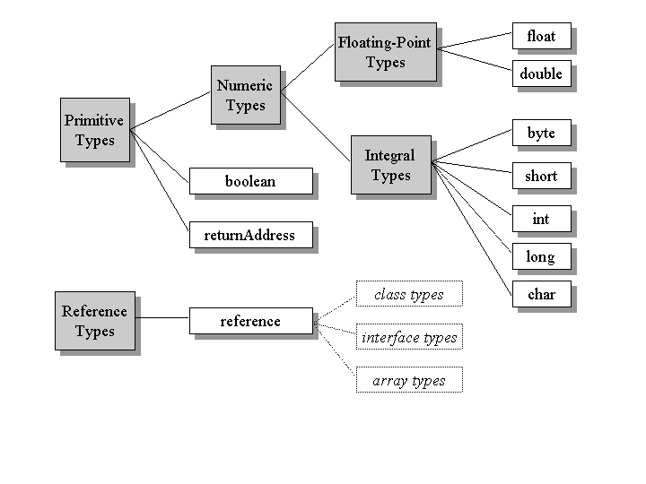

1. JVM
> https://www.artima.com/insidejvm/ed2/jvm.html

### Answer to What is a JVM ? day2

1. The JVM is called "virtual" because it is an abstract computer defined by a specification.
   -  To run a Java program, you need a concrete implementation of the abstract specification. 
   - here we describe primarily the abstract specification of the JVM.
   -  To illustrate the abstract definition of certain features,  also  various ways in which those features could be implemented.

2.  when you say **"JVM."** You may be speaking of:

    1. the abstract specification,
       - described in detail in the book: The JVM Specification
    2. a concrete implementation
       -  it exist on many platforms and come from many vendors, are either all software or a combination of hardware and software.
    3. a runtime instance.
       -  A runtime instance hosts a single running Java application.
        
3.  Each Java application runs inside a runtime instance of some concrete implementation of the abstract specification of the JVM.

4. **The Lifetime of a JVM**
- A runtime instance of the JVM has a clear mission in life:
   -  to run one Java application. 
-  When a Java application starts, a runtime instance is born.
-   When the application completes, the instance dies. 
-   If you start three Java applications at the same time, on the same computer, using the same concrete implementation, you'll get three JVM instances. 
-   Each Java application runs inside its own JVM.

- A JVM instance starts running its solitary application by invoking the main() method of some initial class. 
- The main() method must be public, static, return void, and accept one parameter: a String array. 

1. Inside the JVM, threads come in two flavors:
-  daemon and non- daemon. 
    -  **A daemon thread** is ordinarily a thread used by the virtual machine itself, **such as a thread that performs garbage collection.** The application, however, can mark any threads it creates as daemon threads. 
    -  The initial thread of an application--the **one that begins at main()--is a non- daemon thread**.

    - A Java application continues to execute (the virtual machine instance continues to live) as long as any non-daemon threads are still running.
    -  When all non-daemon threads of a Java application terminate, the virtual machine instance will exit. 
    -  If permitted by the security manager, the application can also cause its own demise by invoking the exit() method of class Runtime or System.
  

###  The Architecture of the JVM
- In the JVM specification, 
  - the behavior of a virtual machine instance is described in terms of
     -  subsystems
     -   memory areas
     -    data types,
     -    and instructions
  -  These components describe an abstract inner architecture for the abstract JVM. 
  -  The purpose of these components 
        -    is more to provide a way to strictly define the external behavior of implementations. 
  -   The specification defines the required behavior of any JVM implementation in terms of these abstract components and their interactions.

- the major subsystems and memory areas described in the specification , each JVM has 
   1. a class loader subsystem:
    -  a mechanism for loading types (classes and interfaces). 
   2. a execution engine: 
   - a mechanism responsible for executing the instructions contained in the methods of loaded classes.

Figure 5-1. The internal architecture of the JVM.
- The JVM organizes the memory it needs to execute a program into several runtime data areas.

- Although the same runtime data areas exist in some form in every JVM implementation, their specification is quite abstract. 
- The abstract nature of the specification of the runtime data areas helps make it easier to implement the JVM on a wide variety of computers and devices.

-  Each instance of the JVM has one method area and one heap. 
-  These areas are shared by all threads running inside the virtual machine. 
-  When the virtual machine loads a class file, it parses information about a type from the binary data contained in the class file. 
-  It places this type information into the method area. 
-  As the program runs, the virtual machine places all objects the program instantiates onto the heap. S

Figure 5-2. Runtime data areas shared among all threads.

- The JVM has no registers to hold intermediate data values.
-  The instruction set uses the Java stack for storage of intermediate data values. 
-  This approach was taken by Java's designers to keep the JVM's instruction set compact and to facilitate implementation on architectures with few or irregular general purpose registers.
-   In addition, the stack-based architecture of the JVM's instruction set
    -  facilitates the code optimization work done by just-in-time and dynamic compilers that operate at run-time in some virtual machine implementations.

### Data Types
The JVM computes by performing operations on certain types of data.
 Both the data types and operations are strictly defined by the JVM specification.
  The data types can be divided into a set of
  1. **primitive types** 
    -  Variables of the primitive types hold primitive values
    -  Primitive values, do not refer to anything. They are the actual data themselves.
    1. All the primitive types of the Java programming language are primitive types of the JVM. 
    2. Although boolean qualifies as a primitive type of the JVM, the instruction set has very limited support for it.
- compiler  uses ints or bytes to represent booleans. **In the JVM, false is represented by integer zero and true by any non-zero integer.** Operations involving boolean values use ints. 

    3. The numeric types are divided between 
         - the integral types: byte, short, int, long, and char, and 
         - the floating- point types: float and double. 
         - As with the Java programming language, the primitive types of the JVM have the same range everywhere. 
         - A long in the JVM always  a 64-bit number, independent of the underlying host platform.

    4. The JVM works with one other primitive type that is unavailable to the Java programmer:
       -  the returnAddress type.
          -  This primitive type is used to implement finally clauses of Java programs. 

  2. **a reference type.**
   - variables of the reference type hold reference values. 
   -  Reference values refer to objects, but are not objects themselves. 
    1. The reference type of the JVM is cleverly named reference.
    2.  Values of type reference come in three flavors:
	-  the class type, 
	-  the interface type,
	-   and the array type. 
	3. All three types have values that are references to dynamically created objects.
	-  The class type's values are references to class instances.
	-  The array type's values are references to arrays, which are full-fledged objects in the JVM.
	-  The interface type's values are references to class instances that implement an interface. 
	4. One other reference value is the null value, which indicates the reference variable doesn't refer to any object.

-  Ranges of the JVM's data types

### Word Size
1. The basic unit of size for data values in the JVM is the word--a fixed size chosen by the designer of each JVM implementation. 

2. The specification of many of the JVM's runtime data areas are based upon this abstract concept of a word.
3.  For example:
  -  two sections of a Java stack frame--the local variables and operand stack-- are defined in terms of words. 
  -  These areas can contain values of any of the virtual machine's data types. 
  -  When placed into the local variables or operand stack, a value occupies either one or two words.

4. The word size does not affect the behavior of a program. It is only an internal attribute of a virtual machine implementation.

### day 3 

1. The Class Loader Subsystem
The part of a Java virtual machine implementation that takes care of finding and loading types is the class loader subsystem. Chapter 1, "Introduction to Java's Architecture," gives an overview of this subsystem. Chapter 3, "Security," shows how the subsystem fits into Java's security model. This chapter describes the class loader subsystem in more detail and show how it relates to the other components of the virtual machine's internal architecture.

As mentioned in Chapter 1, the Java virtual machine contains two kinds of class loaders: a bootstrap class loader and user-defined class loaders. The bootstrap class loader is a part of the virtual machine implementation, and user-defined class loaders are part of the running Java application. Classes loaded by different class loaders are placed into separate name spaces inside the Java virtual machine.

The class loader subsystem involves many other parts of the Java virtual machine and several classes from the java.lang library. For example, user-defined class loaders are regular Java objects whose class descends from java.lang.ClassLoader. The methods of class ClassLoader allow Java applications to access the virtual machine's class loading machinery. Also, for every type a Java virtual machine loads, it creates an instance of class java.lang.Class to represent that type. Like all objects, user-defined class loaders and instances of class Class reside on the heap. Data for loaded types resides in the method area.

Loading, Linking and Initialization
The class loader subsystem is responsible for more than just locating and importing the binary data for classes. It must also verify the correctness of imported classes, allocate and initialize memory for class variables, and assist in the resolution of symbolic references. These activities are performed in a strict order:

Loading: finding and importing the binary data for a type
Linking: performing verification, preparation, and (optionally) resolution
Verification: ensuring the correctness of the imported type
Preparation: allocating memory for class variables and initializing the memory to default values
Resolution: transforming symbolic references from the type into direct references.
Initialization: invoking Java code that initializes class variables to their proper starting values.
The details of these processes are given Chapter 7, "The Lifetime of a Type."
The Bootstrap Class Loader
Java virtual machine implementations must be able to recognize and load classes and interfaces stored in binary files that conform to the Java class file format. An implementation is free to recognize other binary forms besides class files, but it must recognize class files.

Every Java virtual machine implementation has a bootstrap class loader, which knows how to load trusted classes, including the classes of the Java API. The Java virtual machine specification doesn't define how the bootstrap loader should locate classes. That is another decision the specification leaves to implementation designers.

Given a fully qualified type name, the bootstrap class loader must in some way attempt to produce the data that defines the type. One common approach is demonstrated by the Java virtual machine implementation in Sun's 1.1 JDK on Windows98. This implementation searches a user-defined directory path stored in an environment variable named CLASSPATH. The bootstrap loader looks in each directory, in the order the directories appear in the CLASSPATH, until it finds a file with the appropriate name: the type's simple name plus ".class". Unless the type is part of the unnamed package, the bootstrap loader expects the file to be in a subdirectory of one the directories in the CLASSPATH. The path name of the subdirectory is built from the package name of the type. For example, if the bootstrap class loader is searching for class java.lang.Object, it will look for Object.class in the java\lang subdirectory of each CLASSPATH directory.

In 1.2, the bootstrap class loader of Sun's Java 2 SDK only looks in the directory in which the system classes (the class files of the Java API) were installed. The bootstrap class loader of the implementation of the Java virtual machine from Sun's Java 2 SDK does not look on the CLASSPATH. In Sun's Java 2 SDK virtual machine, searching the class path is the job of the system class loader, a user-defined class loader that is created automatically when the virtual machine starts up. More information on the class loading scheme of Sun's Java 2 SDK is given in Chapter 8, "The Linking Model."

User-Defined Class Loaders
Although user-defined class loaders themselves are part of the Java application, four of the methods in class ClassLoader are gateways into the Java virtual machine:

// Four of the methods declared in class java.lang.ClassLoader:
protected final Class defineClass(String name, byte data[],
    int offset, int length);
protected final Class defineClass(String name, byte data[],
    int offset, int length, ProtectionDomain protectionDomain);
protected final Class findSystemClass(String name);
protected final void resolveClass(Class c);
Any Java virtual machine implementation must take care to connect these methods of class ClassLoader to the internal class loader subsystem.

The two overloaded defineClass() methods accept a byte array, data[], as input. Starting at position offset in the array and continuing for length bytes, class ClassLoader expects binary data conforming to the Java class file format--binary data that represents a new type for the running application -- with the fully qualified name specified in name. The type is assigned to either a default protection domain, if the first version of defineClass() is used, or to the protection domain object referenced by the protectionDomain parameter. Every Java virtual machine implementation must make sure the defineClass() method of class ClassLoader can cause a new type to be imported into the method area.

The findSystemClass() method accepts a String representing a fully qualified name of a type. When a user-defined class loader invokes this method in version 1.0 and 1.1, it is requesting that the virtual machine attempt to load the named type via its bootstrap class loader. If the bootstrap class loader has already loaded or successfully loads the type, it returns a reference to the Class object representing the type. If it can't locate the binary data for the type, it throws ClassNotFoundException. In version 1.2, the findSystemClass() method attempts to load the requested type from the system class loader. Every Java virtual machine implementation must make sure the findSystemClass() method can invoke the bootstrap (if version 1.0 or 1.1) or system (if version 1.2 or later) class loader in this way.

The resolveClass() method accepts a reference to a Class instance. This method causes the type represented by the Class instance to be linked (if it hasn't already been linked). The defineClass() method, described previous, only takes care of loading. (See the previous section, "Loading, Linking, and Initialization" for definitions of these terms.) When defineClass() returns a Class instance, the binary file for the type has definitely been located and imported into the method area, but not necessarily linked and initialized. Java virtual machine implementations make sure the resolveClass() method of class ClassLoader can cause the class loader subsystem to perform linking.

The details of how a Java virtual machine performs class loading, linking, and initialization, with user- defined class loaders is given in Chapter 8, "The Linking Model."

Name Spaces
As mentioned in Chapter 3, "Security," each class loader maintains its own name space populated by the types it has loaded. Because each class loader has its own name space, a single Java application can load multiple types with the same fully qualified name. A type's fully qualified name, therefore, is not always enough to uniquely identify it inside a Java virtual machine instance. If multiple types of that same name have been loaded into different name spaces, the identity of the class loader that loaded the type (the identity of the name space it is in) will also be needed to uniquely identify that type.

Name spaces arise inside a Java virtual machine instance as a result of the process of resolution. As part of the data for each loaded type, the Java virtual machine keeps track of the class loader that imported the type. When the virtual machine needs to resolve a symbolic reference from one class to another, it requests the referenced class from the same class loader that loaded the referencing class. This process is described in detail in Chapter 8, "The Linking Model." 

